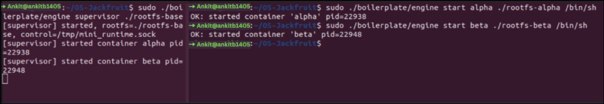
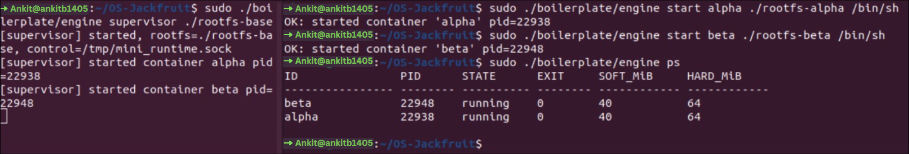
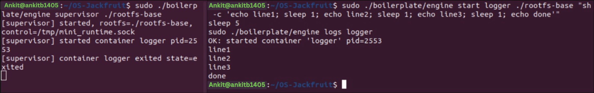
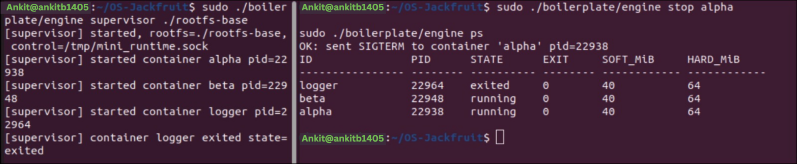
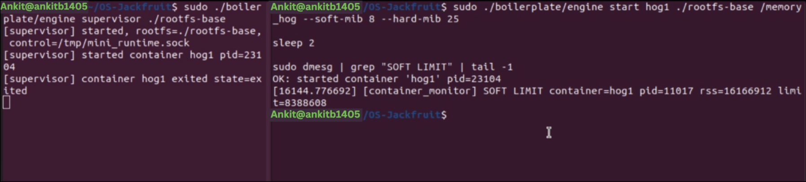
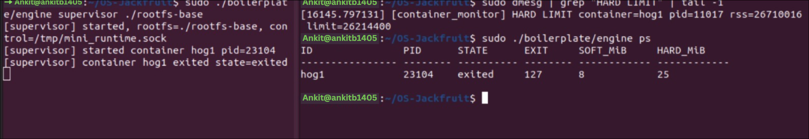
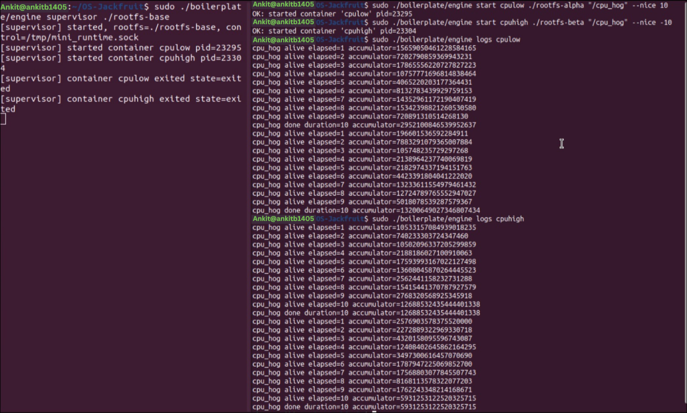
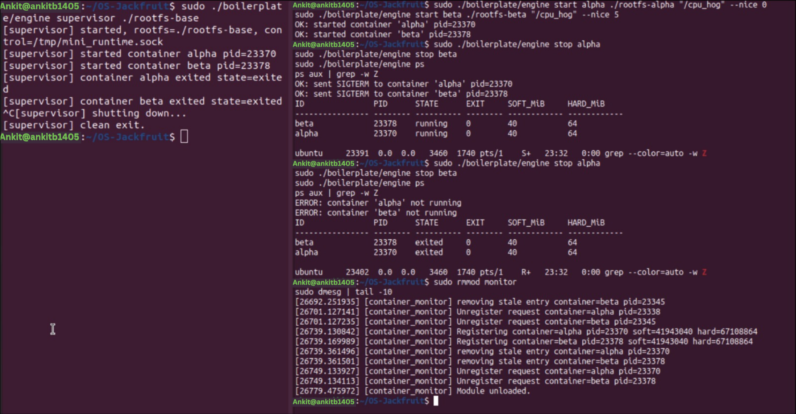

# Multi-Container Runtime

## 1. Team Information

| Name | SRN |
|------|-----|
| Ankit Bembalgi | PES2UG24AM020 |
| Bhuvi Bharadwaj | PES2UG24AM041 |

---

## 2. Build, Load, and Run Instructions

### Prerequisites

- Ubuntu 22.04 / 24.04 VM with **Secure Boot OFF**
- WSL is not supported
- Install dependencies:

```bash
sudo apt update
sudo apt install -y build-essential linux-headers-$(uname -r)
```

### Step 1 - Build

```bash
cd boilerplate
make
```

### Step 2 - Prepare Root Filesystems

```bash
cd ~/OS-Jackfruit
mkdir rootfs-base
wget https://dl-cdn.alpinelinux.org/alpine/v3.20/releases/x86_64/alpine-minirootfs-3.20.3-x86_64.tar.gz
tar -xzf alpine-minirootfs-3.20.3-x86_64.tar.gz -C rootfs-base

# Create one writable copy per live container
cp -a ./rootfs-base ./rootfs-alpha
cp -a ./rootfs-base ./rootfs-beta
```

### Step 3 - Load Kernel Module

```bash
sudo insmod boilerplate/monitor.ko
ls -l /dev/container_monitor
```

### Step 4 - Start Supervisor

```bash
sudo ./boilerplate/engine supervisor ./rootfs-base
```

### Step 5 - Launch Containers

Open another terminal in the repo root:

```bash
sudo ./boilerplate/engine start alpha ./rootfs-alpha /bin/sh
sudo ./boilerplate/engine start beta ./rootfs-beta /bin/sh

sudo ./boilerplate/engine ps
sudo ./boilerplate/engine logs alpha
sudo ./boilerplate/engine stop alpha
sudo ./boilerplate/engine stop beta
```

### Step 6 - Memory Limit Test

```bash
cp boilerplate/memory_hog rootfs-base/
cp -a ./rootfs-base ./rootfs-hog

sudo ./boilerplate/engine start hog1 ./rootfs-hog /memory_hog --soft-mib 8 --hard-mib 25
sleep 5
sudo dmesg | grep "SOFT LIMIT" | tail -1
sudo dmesg | grep "HARD LIMIT" | tail -1
sudo ./boilerplate/engine ps
```

### Step 7 - Scheduler Experiment

```bash
cp boilerplate/cpu_hog rootfs-base/
cp -a ./rootfs-base ./rootfs-cpulow
cp -a ./rootfs-base ./rootfs-cpuhigh

sudo ./boilerplate/engine start cpulow ./rootfs-cpulow /cpu_hog --nice 10
sudo ./boilerplate/engine start cpuhigh ./rootfs-cpuhigh /cpu_hog --nice -10

sleep 10
sudo ./boilerplate/engine logs cpulow
sudo ./boilerplate/engine logs cpuhigh
```

### Step 8 - Cleanup

```bash
sudo ./boilerplate/engine stop alpha
sudo ./boilerplate/engine stop beta
sudo ./boilerplate/engine stop hog1
sudo ./boilerplate/engine stop cpulow
sudo ./boilerplate/engine stop cpuhigh

# Stop the supervisor with Ctrl+C in its terminal

sudo dmesg | tail
sudo rmmod monitor
```

---

## 3. Demo with Screenshots

### Screenshot 1 - Multi-Container Supervision

The supervisor is started once on the left, and two containers (`alpha` and `beta`) are launched from another terminal on the right under the same long-running control process.



---

### Screenshot 2 - Metadata Tracking

The `ps` command shows the tracked metadata for `alpha` and `beta`, including host PID, current state, exit field, and configured soft/hard memory limits.



---

### Screenshot 3 - Bounded-Buffer Logging

The `logger` container emits `line1`, `line2`, `line3`, and `done`, and the `logs` command retrieves the captured output from the logging pipeline without dropped lines.



---

### Screenshot 4 - CLI and IPC

The `stop alpha` command is issued from the CLI client, the supervisor responds with `OK: sent SIGTERM`, and a follow-up `ps` reflects the managed container set through the control IPC path.



---

### Screenshot 5 - Soft-Limit Warning

The kernel module logs the first `SOFT LIMIT` warning for container `hog1` after the memory-hog workload crosses the configured 8 MiB soft threshold.



---

### Screenshot 6 - Hard-Limit Enforcement

`dmesg` records the `HARD LIMIT` event for `hog1`, and `ps` shows the container metadata after enforcement with the configured 8 MiB soft limit and 25 MiB hard limit.



---

### Screenshot 7 - Scheduling Experiment

Two CPU-bound containers are launched with different nice values (`cpulow` at `10` and `cpuhigh` at `-10`), and the collected logs show visibly different accumulation rates under Linux scheduling.



---

### Screenshot 8 - Clean Teardown

Both containers are stopped, the supervisor prints a clean shutdown message, `ps` shows the final exited state, and the module is unloaded after checking for zombie processes.



---

## 4. Engineering Analysis

### 1. Isolation Mechanisms

Each container is launched with `clone()` using PID, UTS, and mount namespaces. PID namespace isolation gives each container its own process tree, so a process listing inside the container only sees container-local tasks. UTS namespace isolation allows each container to set its own hostname independently. Mount namespace isolation ensures filesystem changes such as mounting `/proc` are local to that container. After entering the new namespaces, the child performs `chroot()` into its assigned writable rootfs, making that directory appear as `/` inside the container.

Even with these isolation mechanisms, all containers still share the host kernel. System calls are still serviced by the same kernel instance, and resources like the network stack, kernel memory, and global scheduler remain shared unless extra namespaces or cgroups are added.

### 2. Supervisor and Process Lifecycle

A long-running supervisor is essential because containers are child processes that need to be tracked, signaled, and reaped. The supervisor keeps metadata for each container, listens for CLI requests over a separate control IPC channel, and updates container state on exits and stops. `SIGCHLD` handling is required so the supervisor can call `waitpid()` and avoid zombie processes. The `stop_requested` flag lets the runtime distinguish a manual stop from an unexpected kill.

### 3. IPC, Threads, and Synchronization

This project uses two IPC paths. Path A is pipe-based logging: each container writes `stdout` and `stderr` into a pipe, producer threads read from those pipes, and a consumer thread writes buffered log chunks into per-container log files. The bounded buffer uses a mutex with `not_full` and `not_empty` condition variables to coordinate producers and consumers without busy-waiting. Path B is the control-plane IPC between CLI clients and the supervisor over a UNIX domain socket.

The log buffer and container metadata are protected separately. Without synchronization, concurrent producers could corrupt buffer indices, and command handling could race with exit handling while the supervisor updates metadata.

### 4. Memory Management and Enforcement

RSS represents the resident portion of a process's memory, meaning the pages currently occupying physical RAM. It does not fully describe all virtual memory usage, swapped pages, or every shared-memory detail. A soft limit is useful for warning and observation, while a hard limit is for enforcement. The kernel module checks RSS periodically, logs a warning the first time a soft limit is crossed, and sends `SIGKILL` when the hard limit is exceeded.

The enforcement logic belongs in kernel space because user-space monitoring can be delayed, preempted, or terminated. The kernel module has direct access to process memory information and can enforce limits more reliably.

### 5. Scheduling Behavior

The scheduler experiment uses the runtime as a controlled platform to compare workloads under different configurations. Nice values influence how the Linux Completely Fair Scheduler distributes CPU time, so two CPU-bound containers with different nice values should accumulate work at visibly different rates. A CPU-bound versus I/O-bound comparison also helps illustrate how Linux balances fairness, throughput, and responsiveness.

---

## 5. Design Decisions and Tradeoffs

| Subsystem | Decision | Tradeoff | Justification |
|-----------|----------|----------|---------------|
| Namespace isolation | `CLONE_NEWPID`, `CLONE_NEWUTS`, and `CLONE_NEWNS` with `chroot()` | This does not provide full network isolation | It matches the assignment's focus on process and filesystem isolation without adding extra networking setup complexity |
| Supervisor architecture | Single long-running supervisor with a UNIX domain socket control channel | The supervisor is a single point of failure | It keeps the design understandable while still supporting multiple concurrent containers |
| Logging pipeline | Pipe-per-container with a bounded shared buffer and a logger thread | A slow consumer can back-pressure producers | Blocking producers is preferable to silently dropping log data |
| Kernel monitor | Kernel module with linked-list tracking and periodic RSS checks | Requires root privileges and VM-based testing | It gives reliable soft/hard enforcement and direct visibility into process RSS |
| Scheduling experiments | Nice-value comparisons using the provided workloads | Nice values influence weights, not hard CPU caps | They are simple to demonstrate and clearly tied to Linux scheduling behavior |

---

## 6. Scheduler Experiment Results

Fill this section after running the experiment and collecting actual measurements.

Suggested table:

| Container | Workload | Nice Value | Observed Result |
|-----------|----------|------------|-----------------|
| `cpuhigh` | `cpu_hog` | `-10` | Replace with measured output |
| `cpulow` | `cpu_hog` | `10` | Replace with measured output |

Brief interpretation to add after collecting results:

- Explain which container received more CPU time and why
- Relate the observation to CFS fairness and task weights
- Mention any VM-specific limitations or noise in the measurements
